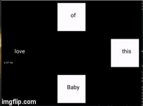

# Flashing Tiles

This is an attempt to implement Flashing Tiles experiment to study "Steady State Visual Potential" using Python.

## How the experiment looks like.


The experiment is implemented using [Kivy](https://github.com/kivy/kivy). Kivy provides `schedule_interval` that is easier
to implement than Pygame which is used by [gumpy-paradigms](https://github.com/gumpy-bci/gumpy-paradigms) 
and also provide faster update rate. Below are error rates of the frequency of each tile. 

```
On Exit Report
[Tile with 6.00 hz]
[Average Frequency] 5.8857
[Average Absolute Error] 5.84%
[SD of Frequency] 0.01
[Average Absolute FPS] 78.30 fps
[Tile with 6.57 hz]
[Average Frequency] 6.4873
[Average Absolute Error] 2.52%
[SD of Frequency] 0.00
[Average Absolute FPS] 78.33 fps
[Tile with 7.50 hz]
[Average Frequency] 7.6741
[Average Absolute Error] 3.72%
[SD of Frequency] 0.00
[Average Absolute FPS] 78.33 fps
[Tile with 8.57 hz]
[Average Frequency] 8.0253
[Average Absolute Error] 8.44%
[SD of Frequency] 0.01
[Average Absolute FPS] 78.31 fps
```

## Installation

1. use `Python 3.7.2`
2. install `pipenv`
3. install all of dependencies with `pipenv install`
4. enter pipenv environment with `pipenv shell`
5. start the app with `python main.py`

## Default Experiment Sequence

1. Start with resting for 20s
2. Start first trial
3. Instruction of the first random condition for 5s
4. Play the first random condition for 10s
5. Repeat 3. and 4. until all three condition are shown
6. Repeat 3. to 5. for 12 trials

## Config

Look at `config/`, you'll find various config and constant value files.

1. `apprearance.py` will be about general appearance of the app eg. color, whether to show frequency label.
2. `experiment_setup.py` is the main config file. Here you can set
    
    2.1 `scenarios` is where you and new condition for the experiment. Whether to show random word from `word_list`
    and the frequency of random words. `tiles` is where you add a new tile to the condition.
    
    2.2 `break_scenarios` is where you setup what to show during break time between each condition.
    
    2.3 `story_setup` is where you set how the overall experiment is run.
    
    - `enable_random` for showing each condition in random.
    - `scenario_order` is if you want to order which condition to show first based on list indexed of `scenarios`.
    - `scenario_interval` is for setting how long each condition shows.
    - `break_interval` is for setting how long the break interval is.
    - `num_episode` is for setting how many series of experiment will be run. For example, if you put 4 here
    with 3 scenarios, the program will play these 3 scenarios for 4 times.

## TODO

1. Find out how to calibrate frequency
