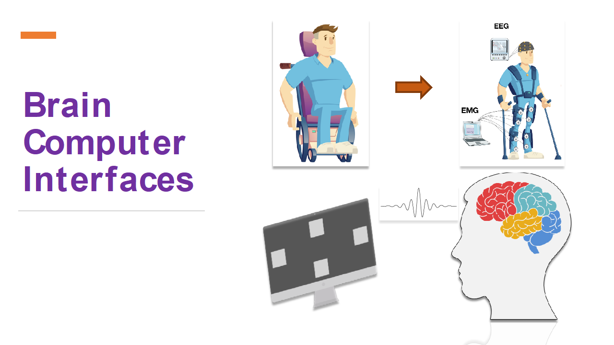
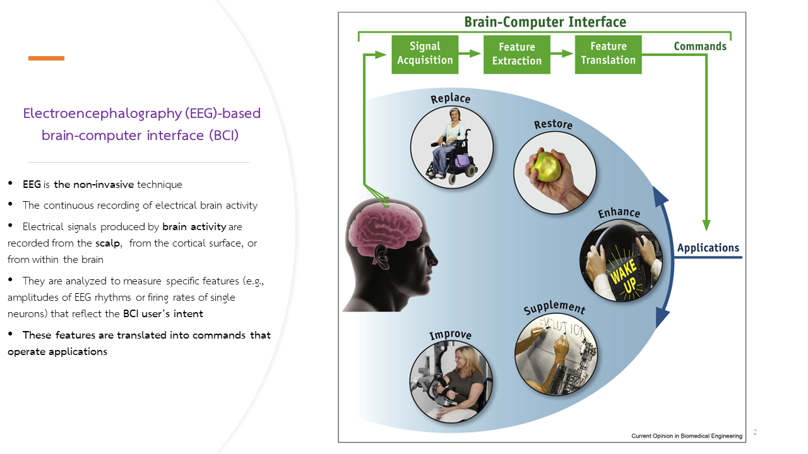
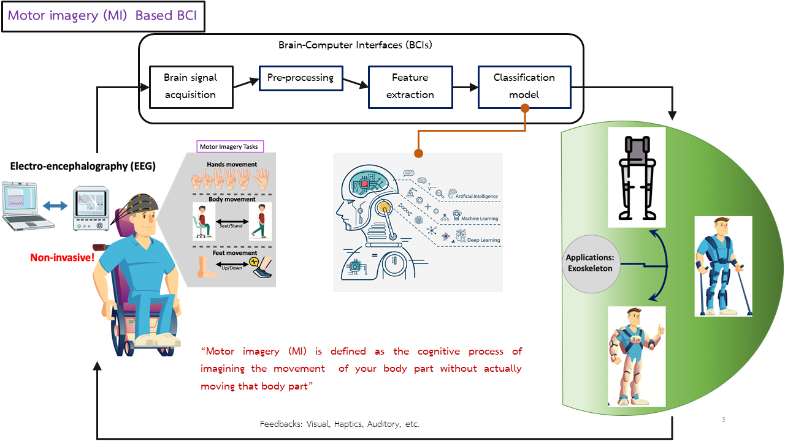
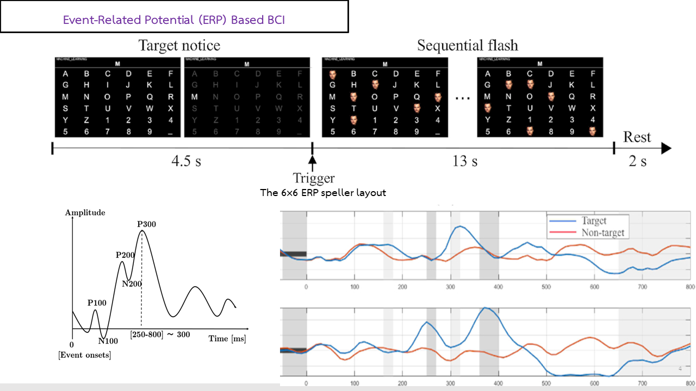
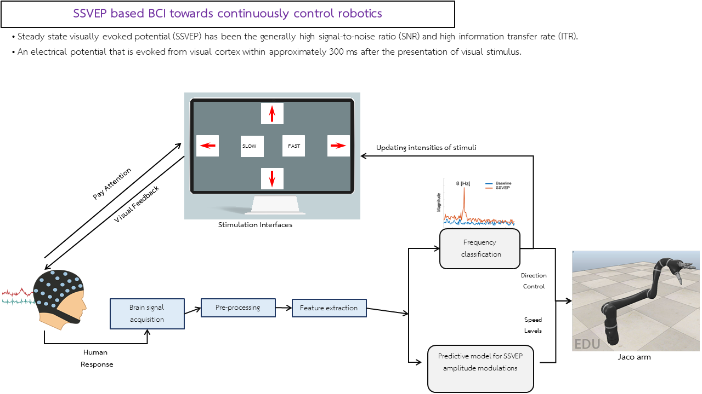

# Brain-Computer Interfaces - Machine Learning
> "Deep Learning"  

## How to Get start

Follow the instruction in each LAB files.  
The Answers are also in the "Answer_workshop" directory

### Important

You wil need to create 3 blank directories that are use in this workshop
- 3DCNN_weights
- simple_model_weights
- weights
